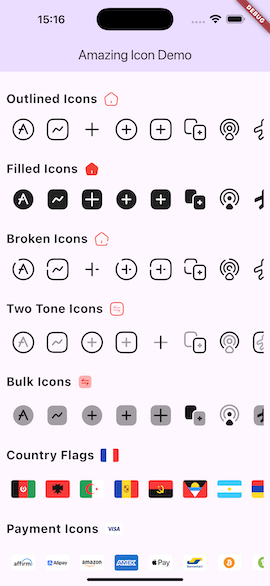
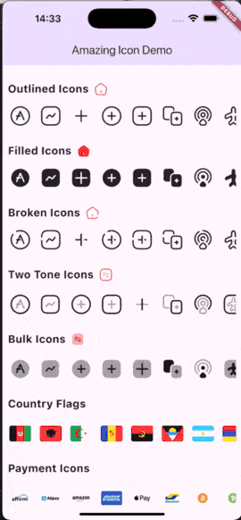

[](https://pub.dev/packages/amazing_icons)
[](LICENSE)
[](https://dart.dev/null-safety)
[](https://flutter.dev)
[](https://pub.dev/packages/amazing_icons)

# Amazing Icon
<a href="https://www.buymeacoffee.com/o.nicks" target="_blank">
  
</a>
<br>
<br>
A comprehensive Flutter icon package featuring **5,000+ icons** across multiple styles including high-performance icon fonts with opacity effects, country flags, and payment method logos.


## Demo Screenshots





## Features

- 🎨 **3 Icon Font Styles**: Outlined, Filled, and Broken styles (992 icons each)
- 🔄 **2 Icon Font Styles with Opacity**: Bulk and TwoTone using dual-layer rendering for depth effects (989 & 946 icons)
- 🏳️ **266 Country Flags**: Full-color vector flags with customizable shapes (circle, rounded, sharp)
- 💳 **39 Payment Icons**: Popular payment method logos (Visa, Mastercard, PayPal, etc.)
- 📦 **Easy to Use**: Simple API with typed accessors for all icons
- 🎯 **Type Safe**: Full Dart type safety with autocomplete support
- 🚀 **High Performance**: 10x faster rendering with icon fonts and optimized SVG format
- ⚡ **Lightweight**: Instant loading with native rendering and compact asset formats

## Browse All Icons

🌐 **[View all icons at amazingicons.dev →](https://www.amazingicons.dev)**

Explore the complete collection with a searchable gallery and preview all icon styles interactively.

## Usage

### Icon Fonts (Outlined, Filled, Broken)

Icon fonts work just like Flutter's built-in `Icons`. They're perfect for single-color icons.

```dart
import 'package:amazing_icons/amazing_icons.dart';

// Outlined style
Icon(AmazingIconOutlined.home, size: 24, color: Colors.blue)

// Filled style
Icon(AmazingIconFilled.heart, size: 24, color: Colors.red)

// Broken style
Icon(AmazingIconBroken.notification, size: 24, color: Colors.orange)

// List all icons in a category
Wrap(
  children: AmazingIconOutlined.all()
    .map((icon) => Icon(icon, size: 40))
    .toList(),
)
```

### Icon Fonts with Opacity Effects (Bulk & TwoTone)

**NEW in v2.0!** These icons use dual-layer icon fonts to create depth effects with customizable opacity. 10x faster than SVG rendering!

```dart
import 'package:amazing_icons/amazing_icons.dart';

// Bulk style (dual-layer with opacity effect)
AmazingIconBulk.home(size: 24, color: Colors.blue, opacity: 0.4)

// TwoTone style (dual-layer with opacity effect)
AmazingIconTwotone.heart(size: 24, color: Colors.red, opacity: 0.4)

// Custom opacity for different effects
AmazingIconBulk.search(size: 30, color: Colors.purple, opacity: 0.2)  // Subtle effect
AmazingIconBulk.star(size: 30, color: Colors.amber, opacity: 0.6)     // Stronger effect

// Get sample icons
Widget buildIconGrid() {
  return Wrap(
    spacing: 8,
    runSpacing: 8,
    children: AmazingIconBulk.allIcons,  // Returns List<Widget>
  );
}
```

### Country Flags

Full-color vector country flags with customizable shapes. Uses optimized `jovial_svg` for fast rendering.

```dart
import 'package:amazing_icons/amazing_icons.dart';

// Different shapes
AmazingIconCountry.fromCountryCode(countryCode: "fr", size: 25, shape: IconShape.rounded)
AmazingIconCountry.fromCountryCode(countryCode: "us", size: 25, shape: IconShape.sharp)
AmazingIconCountry.fromCountryCode(countryCode: "jp", size: 25, shape: IconShape.circle)

// Default rounded shape
AmazingIconCountry.fromCountryCode(countryCode: "de", size: 30)

// Unknown country code shows placeholder
AmazingIconCountry.fromCountryCode(countryCode: "xx", size: 25)
```

### Payment Icons

Popular payment method logos with original brand colors preserved. Uses optimized `jovial_svg` for fast rendering.

```dart
import 'package:amazing_icons/amazing_icons.dart';

// Popular payment methods
AmazingIconPayment.visa(size: 50)
AmazingIconPayment.mastercard(size: 50)
AmazingIconPayment.apple_pay(size: 50)
AmazingIconPayment.google_pay(size: 50)

// Cryptocurrency
AmazingIconPayment.bitcoin(size: 50)
AmazingIconPayment.etherium(size: 50)

// Display sample payment methods
Widget buildPaymentRow() {
  return Wrap(
    spacing: 16,
    runSpacing: 16,
    children: AmazingIconPayment.someIcons(),  // Returns sample icons
  );
}
```

## Icon Categories

### Icon Fonts (997 icons each)
- **Outlined**: Clean outline style icons
- **Filled**: Solid filled icons
- **Broken**: Modern broken/interrupted line style

### Icon Fonts with Opacity Effects
- **Bulk** (997 icons): Dual-layer icons with customizable opacity-based depth effect
- **TwoTone** (991 icons): Dual-layer icons with customizable two-tone opacity styling

### Colored Icons (Optimized SVG)
- **Country Flags** (201 flags): All country flags in full color with shape customization
- **Payment** (39 icons): Payment brands and cryptocurrency logos in original colors


## Example

Check out the [example](example/) folder for a complete demo app showing all icon styles and categories.

```bash
cd example
flutter run
```

## Icon Reference

### Common Icons Available

**UI & Navigation**: home, settings, menu, search, filter, notification, calendar, clock, timer, etc.

**Social & Communication**: message, chat, call, video, mail, share, user, profile, etc.

**Media**: play, pause, stop, music, video, camera, gallery, image, etc.

**Business**: wallet, card, money, receipt, chart, graph, document, folder, etc.

**Technology**: code, cpu, monitor, mobile, laptop, cloud, database, network, etc.

**Crypto**: bitcoin, ethereum, binance, cardano, polkadot, and 50+ more cryptocurrencies

**And many more!**

## Performance

- **Icon fonts render instantly** with no loading time or asset parsing
- **10x faster** Bulk & TwoTone rendering using dual-layer icon fonts instead of SVG
- **Optimized `.si` format** for Country and Payment icons (via `jovial_svg`)
- **Lower memory usage** with native icon font rendering
- **Compact package size** with efficient asset formats

## Requirements

- Flutter SDK: >= 3.0.0
- Dart SDK: >= 3.0.0

## Contributing

Contributions are welcome! If you find a bug or want to add a feature:

1. Open an issue to discuss the change
2. Fork the repository
3. Create your feature branch
4. Submit a pull request

## License

This package is licensed under the MIT License - see the [LICENSE](LICENSE) file for details.

## Support

If you find this package useful, please give it a ⭐ on [GitHub](https://github.com/O-Nicks/amazing_icons)!

For issues and feature requests, please file them on the [issue tracker](https://github.com/O-Nicks/amazing_icons/issues).
